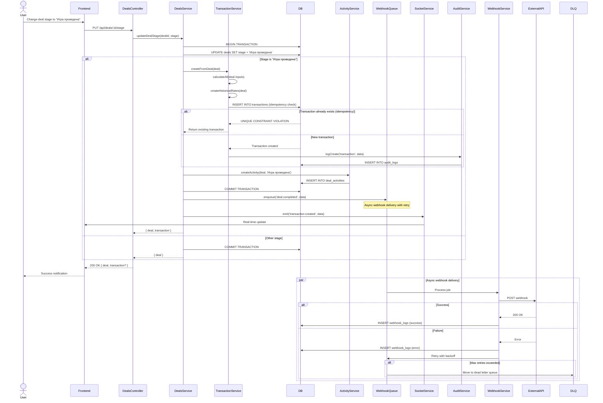
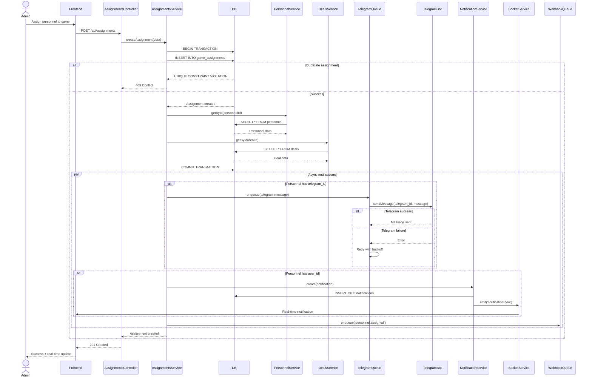
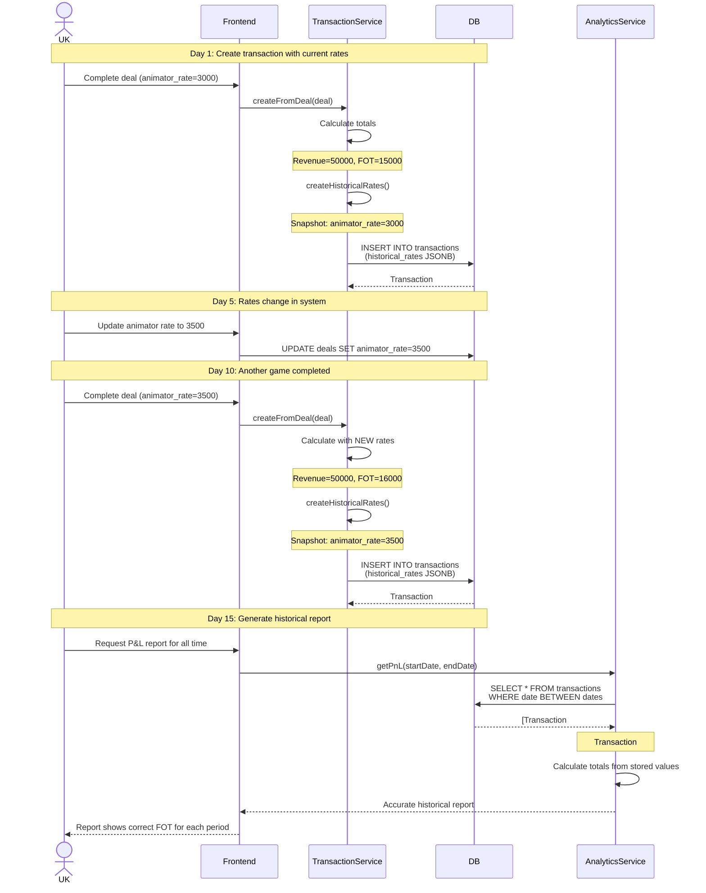
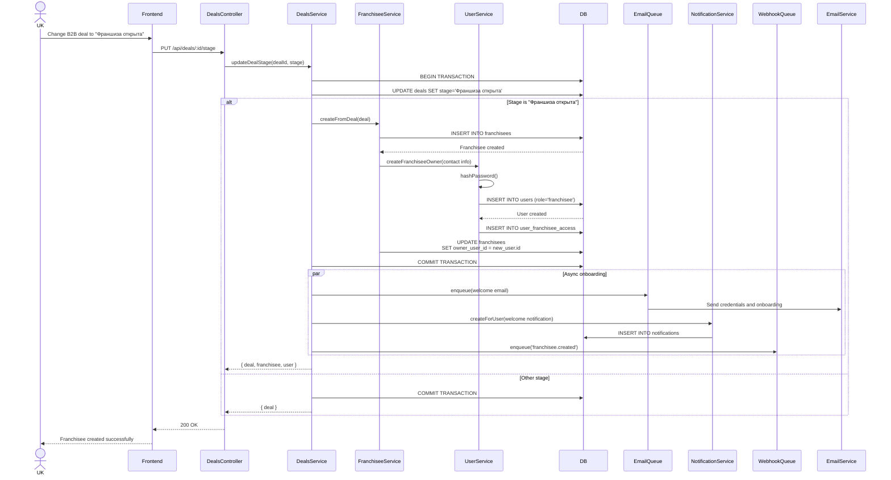
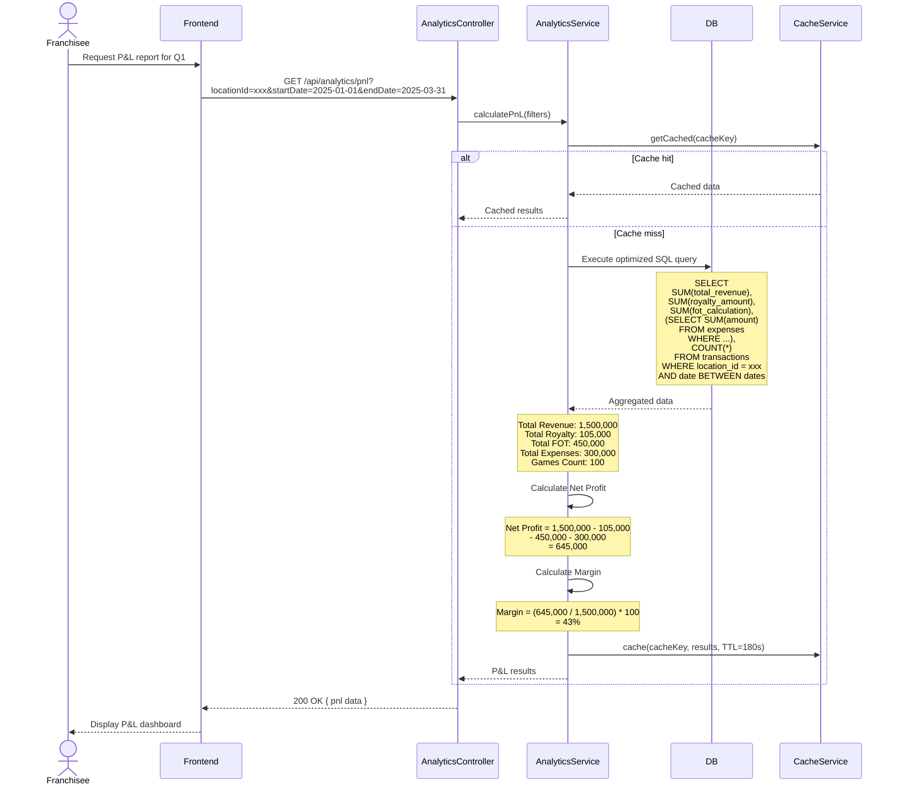
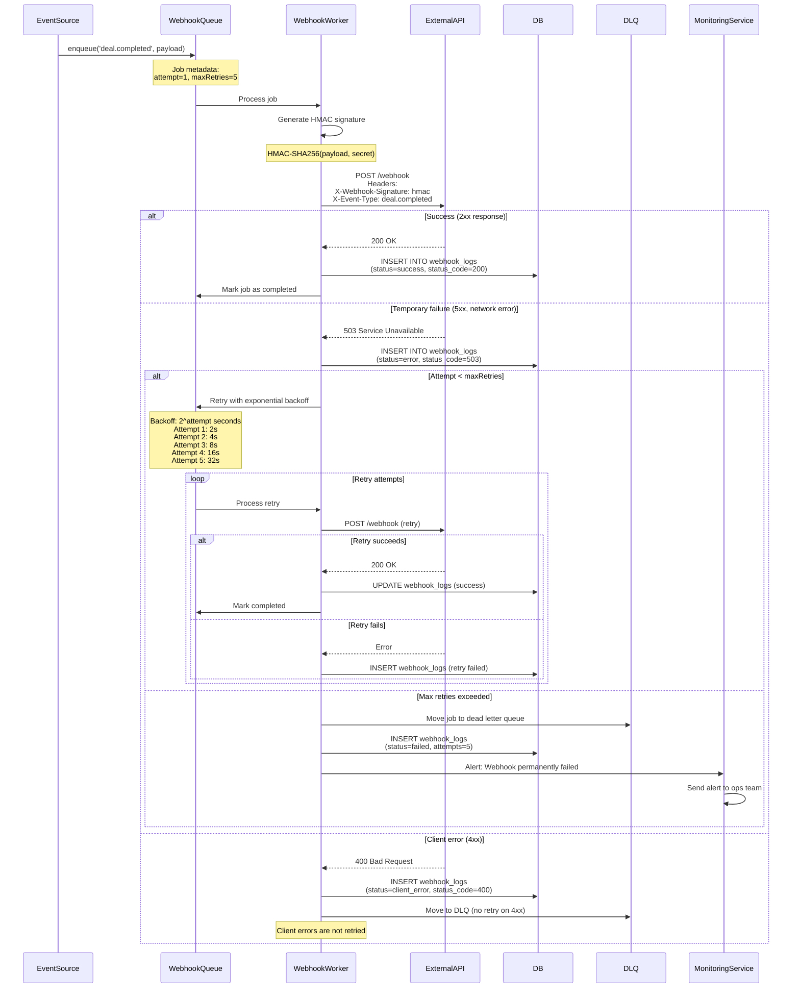
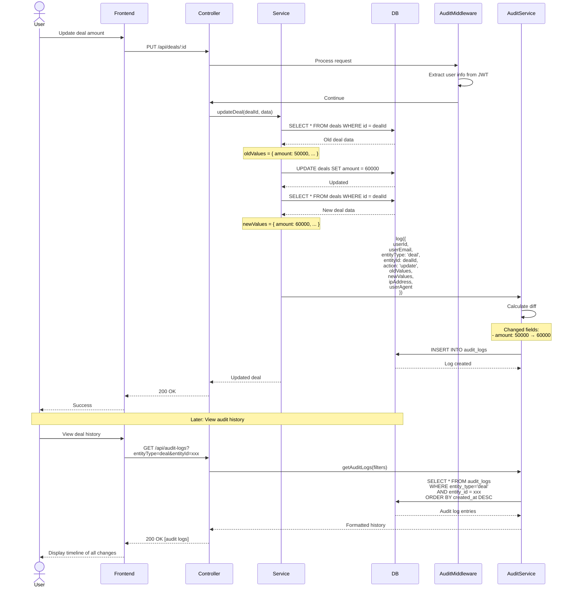

# QuestLegends OS 2.0 - Sequence Diagrams

This document contains sequence diagrams for all critical business scenarios in the system.

## 1. Game Completion Flow (B2C Deal → Transaction)

This diagram shows the complete flow when a game is completed, including transaction creation, activity logging, and notifications.



**Key Points:**
- Database transaction ensures atomicity of deal update and transaction creation
- Idempotency key prevents duplicate transactions on concurrent requests
- Webhooks sent asynchronously with retry mechanism
- Socket events for real-time UI updates
- All changes logged in audit_logs

---

## 2. Personnel Assignment with Telegram Notification

This diagram shows how personnel is assigned to a game and notified via Telegram.



**Key Points:**
- Telegram notifications sent asynchronously via queue
- System notification created even if telegram_id missing
- Unique constraint prevents duplicate assignments
- Real-time updates via Socket.io
- Webhook fired for external integrations

---

## 3. Historical Rates & Calculation Integrity

This diagram shows how historical rates are preserved when rates change.



**Key Points:**
- Historical rates snapshot saved on transaction creation
- Future rate changes don't affect past transactions
- Reports use stored calculated values, not recalculation
- Data integrity maintained for accounting

---

## 4. B2B Franchise Sale (Lead → Franchisee)

This diagram shows the conversion from B2B lead to active franchisee.



**Key Points:**
- Atomic creation of franchisee, user, and access rights
- Automatic credential generation and secure password hashing
- Welcome email sent asynchronously
- User immediately has access to their dashboard

---

## 5. Net Profit Calculation with Expenses

This diagram shows optimized P&L calculation using SQL aggregations.



**Key Points:**
- Single SQL query with aggregations (no N+1 problem)
- All calculations done in database for performance
- Results cached for 3 minutes to reduce DB load
- Scales to 100k+ transactions with proper indexes

---

## 6. Webhook Reliability with Retry & DLQ

This diagram shows the robust webhook delivery system.



**Key Points:**
- HMAC signature for webhook authentication
- Exponential backoff retry strategy
- Dead letter queue for failed webhooks
- Different handling for 4xx vs 5xx errors
- Complete audit trail in webhook_logs

---

## 7. Audit Log System

This diagram shows how all data changes are automatically logged.



**Key Points:**
- Automatic logging via middleware
- Old and new values stored for complete history
- User identity, IP, and user agent tracked
- Immutable audit trail for compliance
- Easy to query and display change history

```
